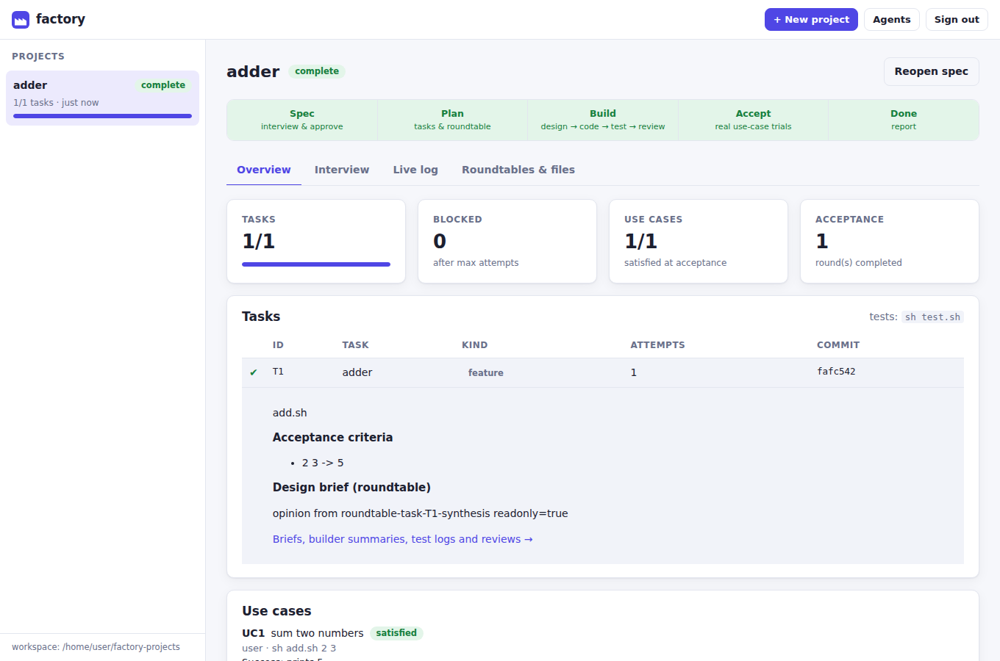
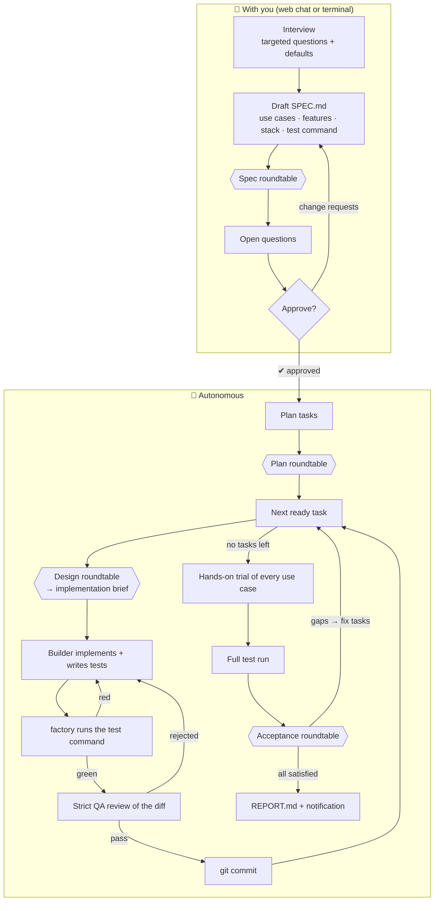
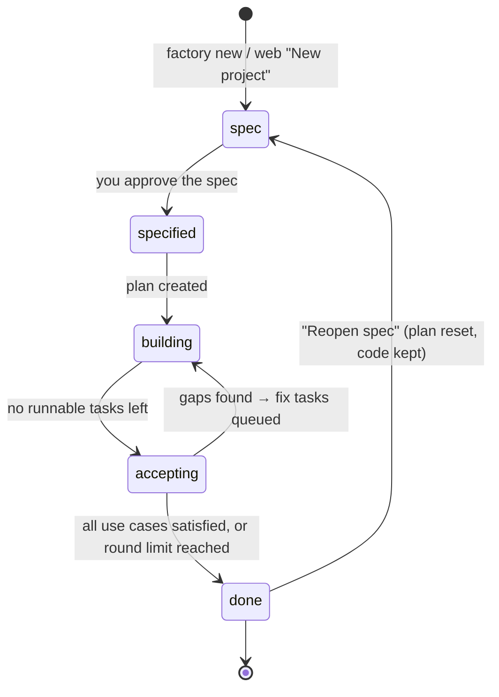
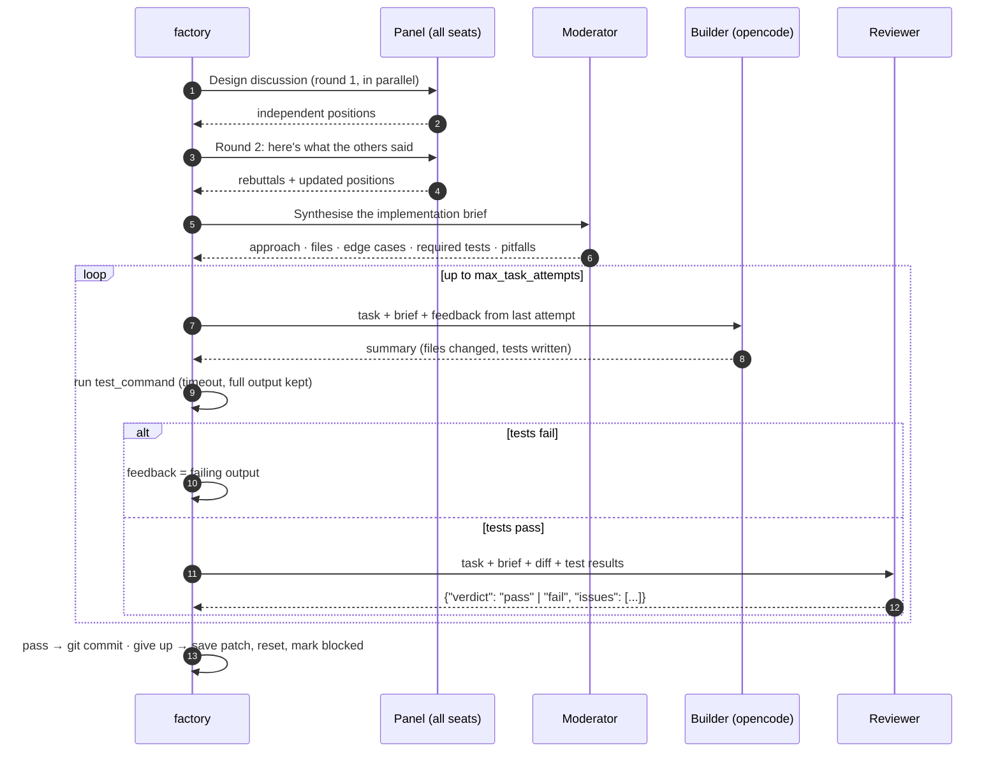
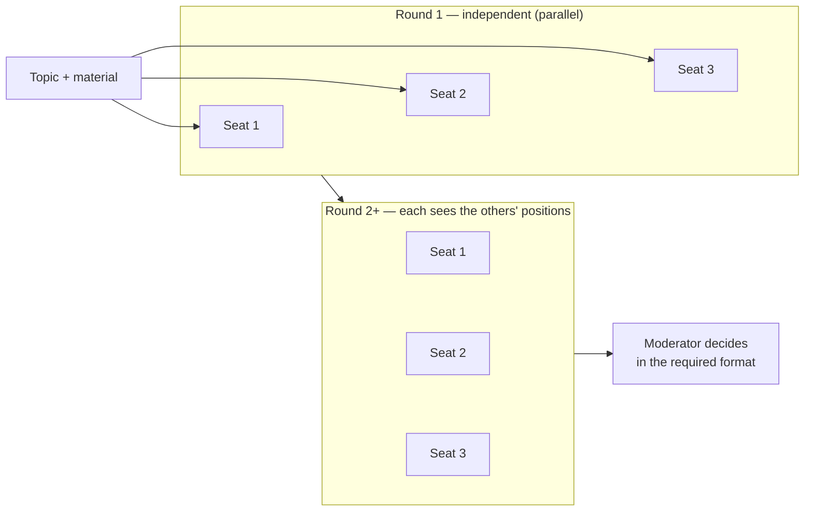
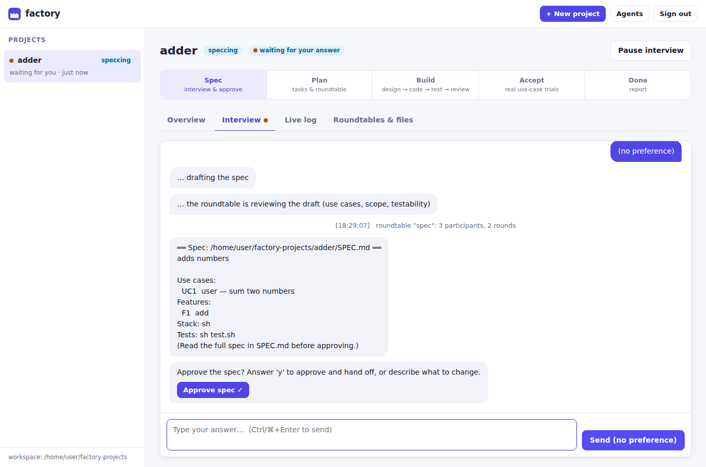
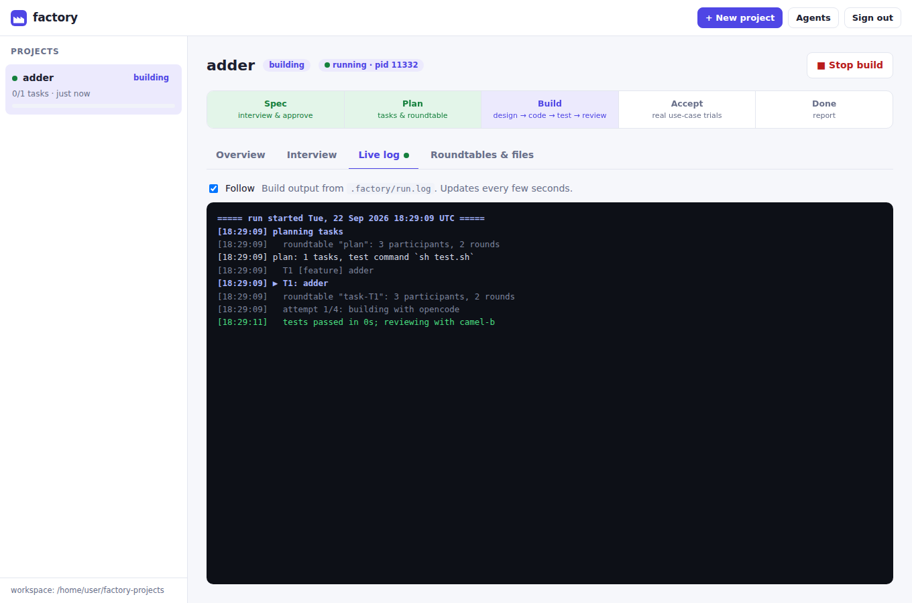
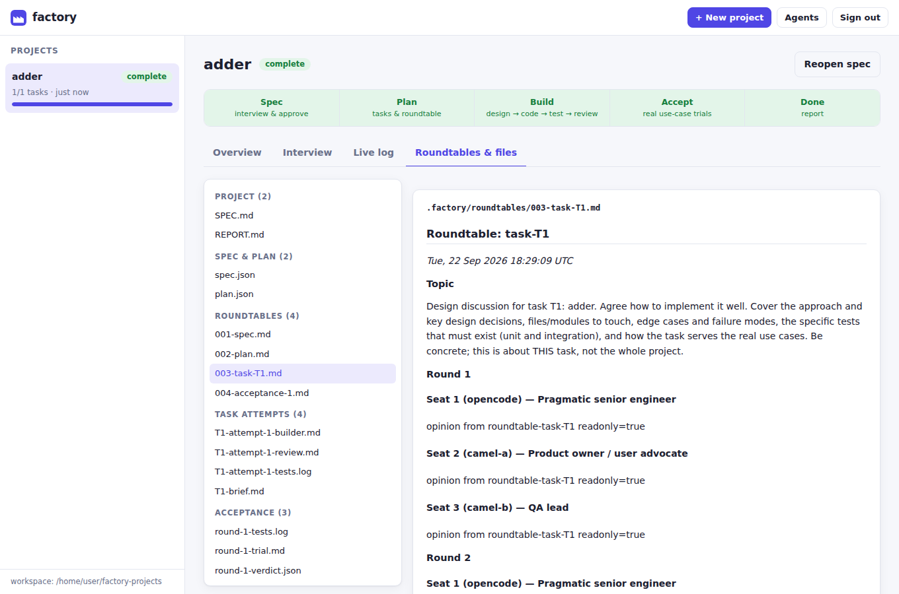
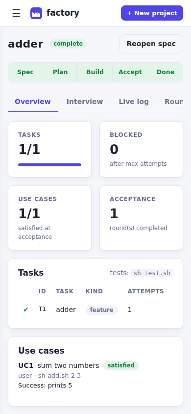

# factory

**Submit an idea. Spec it together. Walk away.**

factory takes a project from a rough idea to working software you can test, using the coding agents you already pay for: opencode for building, plus as many other agents as you like (such as CAMEL-AI) for discussion and review. It interviews you until the idea can be built, has your agents argue over the spec, and then works on its own. It plans the work, holds a design roundtable before every task, builds, runs your tests, rejects fake tests, tries out every genuine use case the way a real user would, and loops until it's done.

It's a lightweight alternative to heavier orchestrators such as Paperclip: **one Go binary, no database, no containers, no runtime dependencies** (the terminal interface's UI library is compiled in, so there is nothing to install alongside it). Everything is plain files inside your project, so you can stop it at any moment and pick up exactly where it left off. It comes with a **terminal workspace** for driving builds yourself and a **web interface** you can run on your Linux machine and reach from anywhere, including from inside your own website.



<sub>Screenshots in this README come from a demo run with scripted stand-in agents, so panel text like "opinion from …" is placeholder output.</sub>

---

## Contents

- [Features](#features)
- [How it works](#how-it-works)
  - [The pipeline](#the-pipeline)
  - [Project lifecycle](#project-lifecycle)
  - [Inside one task](#inside-one-task)
  - [Roundtables](#roundtables)
  - [Acceptance: genuine use cases](#acceptance-genuine-use-cases)
  - [How testing layers stack up](#how-testing-layers-stack-up)
- [Quick start](#quick-start)
- [Setting up your agents](#setting-up-your-agents)
- [The terminal workspace](#the-terminal-workspace)
- [The web interface](#the-web-interface)
- [Running it on your Linux machine](#running-it-on-your-linux-machine)
- [Remote control and adding it to your website](#remote-control-and-adding-it-to-your-website)
- [Security model](#security-model)
- [CLI reference](#cli-reference)
- [HTTP API reference](#http-api-reference)
- [Configuration reference](#configuration-reference)
- [What gets written to disk](#what-gets-written-to-disk)
- [Resilience and resuming](#resilience-and-resuming)
- [Tips, costs and troubleshooting](#tips-costs-and-troubleshooting)
- [Architecture and development](#architecture-and-development)

---

## Features

**Spec with a human in the loop**
- A conversational **interview**: targeted questions in up to 3 rounds, each with a proposed default. Leave any answer blank and the agent decides.
- The spec is written around **genuine use cases**: an actor, a step-by-step scenario with realistic inputs, and an outcome you can observe. They aren't just a restated feature list.
- A **spec roundtable** reviews the draft before you see it, looking for missing use cases, scope creep, ambiguity, untestable criteria, and things that will break when nobody is watching.
- Any **open questions** come back to you. You then approve, or say in plain words what to change.

**Autonomous build**
- **Planning** produces ordered tasks: a setup task (skeleton, README, a test suite that passes), feature slices with acceptance criteria you can check, and one end-to-end test task per use case. A **plan roundtable** critiques the plan first.
- A **design roundtable before every task** agrees the approach, edge cases and the specific tests that must exist. The moderator turns that into a brief for the builder.
- **Build → test → review loop.** The builder (opencode) implements the task and writes tests. factory runs your test command itself; it never takes the builder's word for it. A strict reviewer then reads the diff and rejects tautological, skipped or over-mocked tests. Every rejection goes back to the builder as concrete feedback, for up to 4 attempts.
- **Stuck tasks can't cause damage.** After the last attempt the work is saved as a patch and the tree is reset to the last good commit. Tasks that depend on it are marked blocked, and everything else carries on.
- **One git commit per task that passes**, with the reviewer's summary as the message.

**Acceptance against reality**
- **Hands-on trial**: the builder actually uses the finished software for every use case (runs the CLI, starts the server and sends requests, and so on) and reports what really happened. Anything the trial writes is thrown away.
- An **acceptance roundtable** judges each use case from the point of view of its real users. Gaps become **fix tasks** and the build loop runs again, for up to 3 acceptance rounds.
- When it finishes it writes `REPORT.md`, with an optional push notification.

**Operations**
- **Web interface**: create projects, answer the interview in a chat, start and stop builds, watch a live log, and browse every roundtable transcript, brief, test log and review. It works on a phone.
- **Remote control**: token auth, a login page, a base path for reverse proxies, an iframe-embedding policy, CORS for your own frontend, and an optional direct TLS listener.
- **CLI** for everything as well: `new`, `spec`, `run --detach`, `status`, `logs`, `stop`, `doctor`, `serve`.
- **Resumable at any point.** Builds run as detached processes that keep going if the web server restarts.
- **Pluggable agents**: opencode, any CLI (prompt via stdin or argument), or any OpenAI-compatible HTTP endpoint.

---

## How it works

### The pipeline



The roles are configurable: **interviewer**, **planner**, **builder**, **reviewer** and **moderator** can each be any configured agent. Only the builder edits files. Every other call is read-only.

### Project lifecycle

A project moves through five phases, stored in `.factory/state.json`. The web UI shows them as a stepper at the top of each project.



| Phase | What's happening | Needs you? |
|---|---|---|
| `spec` | Interview, drafting, spec roundtable, approval | **Yes**, answering in the chat |
| `specified` | Spec approved and committed; planning is next | No |
| `building` | Working through tasks | No |
| `accepting` | Trial, full test run, acceptance roundtable | No |
| `done` | `REPORT.md` written. Outcome is `complete` or `finished-with-issues` | Only to read the report |

### Inside one task



Some details that matter:
- **Tests are run by factory, not by the builder.** A task passes only if your `test_command` exits 0 *and* the reviewer passes it.
- **When tests fail, the reviewer isn't called at all.** It would cost agent calls for no benefit. The failing output goes straight back to the builder.
- **Readiness respects `depends_on`.** If a dependency is blocked, the tasks that depend on it are blocked too. If the planner creates a dependency cycle, factory runs the first pending task anyway rather than deadlocking.
- **Every attempt is recorded**: `.factory/tasks/T3-attempt-2-builder.md`, `-tests.log` and `-review.md`, plus `T3-brief.md` and, if the task was blocked, `T3-unfinished.patch`.

### Roundtables

A roundtable is a structured multi-agent discussion. Each seat is an agent with a persona. The default panel:

| Seat | Agent | Persona |
|---|---|---|
| 1 | opencode | Pragmatic senior engineer who can read the repository |
| 2 | camel-a | Product owner and end-user advocate who cares about genuine use cases and scope |
| 3 | camel-b | QA and test lead who cares about testability, edge cases, failure modes and security |



- Round 1 collects independent opinions, so the seats don't anchor on each other. From round 2 on, each seat responds to the others' latest positions: where it agrees, where it disagrees, and what's still missing.
- The **moderator** resolves disagreements and produces the output that step needs: a revised spec, a revised plan, an implementation brief, or an acceptance verdict with fix tasks.
- If a seat fails in a round, the discussion carries on without it. If every seat fails, the moderator decides alone.
- Every transcript is saved to `.factory/roundtables/NNN-<topic>.md` and can be read in the web UI.

| Roundtable | When | Moderator output |
|---|---|---|
| `spec` | After the first draft | Revised spec (Markdown + JSON) |
| `plan` | After planning | Revised task list |
| `task-<id>` | Before each task's first attempt | Implementation brief |
| `acceptance-<n>` | Each acceptance round | Per-use-case verdicts and fix tasks |

Each can be switched off (`on_spec`, `on_plan`, `on_tasks`). The acceptance roundtable always runs.

### Acceptance: genuine use cases

Passing tests aren't the finish line. When no tasks remain:

1. **Hands-on trial.** The builder is told to act as the real users and follow every use-case scenario through the real entry points, with realistic inputs. It reports `{"id", "worked", "what_i_did", "observations"}` for each one. Any files it changes are discarded (and saved as a patch for inspection).
2. **Full test run** of the whole suite.
3. **Acceptance roundtable.** The panel judges each use case *as its actor*, using the trial report, test output, README and file list as evidence. It's told to be sceptical: green tests don't prove anything if they don't reflect real use.
4. **Verdict.** A use case is `satisfied` only if the evidence shows a real user could achieve it. Gaps become fix tasks (`A1.1`, `A1.2`, …) and the build loop runs again. If the panel finds problems but proposes no fixes, factory generates them itself, one per unsatisfied use case plus one for a failing suite.
5. In the **last round** (`max_acceptance_rounds`), remaining gaps are recorded in the report instead of being queued.

### How testing layers stack up

| Layer | Who | Catches |
|---|---|---|
| Unit and integration tests per task | Builder, guided by the brief's "required tests" | Logic bugs, edge cases |
| Independent test run | factory itself | "I ran the tests and they passed" when they didn't |
| Diff review | Reviewer | Missing criteria, tautological, skipped or over-mocked tests, spec violations |
| End-to-end test per use case | Planner schedules it, builder writes it | Features that don't join up into a working flow |
| Hands-on trial | Builder acting as the user | Things that pass tests but don't work when you actually use them |
| Acceptance roundtable | The whole panel, as the users | Use cases that are technically done but don't serve the user |

---

## Quick start

```sh
# 1. Install (Go 1.24+). Requires git on PATH.
go install github.com/dylan-demolder/factory/cmd/factory@latest
#   or: git clone … && cd Factory && go build -o ~/.local/bin/factory ./cmd/factory

# 2. Create a config
mkdir -p ~/.config/factory && cd ~/.config/factory
factory init                 # writes factory.json + adapters/camel_agent.py
$EDITOR factory.json         # models, CAMEL endpoints (see below)

# 3. Check every agent answers
factory doctor

# 4a. Web interface
factory serve                # prints the access token; open http://127.0.0.1:7700/

# 4b. …or the terminal
factory new todo-cli         # interview → spec → approve → build starts in the background
factory status todo-cli
```

`factory` finds its config in this order: `--config`, then `$FACTORY_CONFIG`, then `./factory.json`, then `~/.config/factory/factory.json`. When a project is created, the config is **snapshotted** into `<project>/.factory/config.json`, so later edits don't change a build that's already running.

---

## Setting up your agents

### opencode (the builder)

```json
"opencode": { "type": "opencode", "model": "", "timeout": "45m" }
```

- factory runs `opencode run [--model M] "<prompt>"` in the project directory.
- Leave `model` empty to use your opencode default, or pick one of your **OpenCode Go** models from `opencode models`.
- For read-only work (roundtables, reviews), factory adds `--agent plan`, opencode's built-in agent that can't edit files. Override this with `readonly_args`.
- Prompts larger than about 96 KB are written to `.factory/tmp/` and opencode is told to read that file, to get around the operating system's argument-length limit.
- Unattended runs can't answer permission prompts, so before planning factory writes an `opencode.json` into the project that allows `edit`, `bash` and `webfetch`. An existing `opencode.json` or `opencode.jsonc` is left alone. If you keep your own, make sure it doesn't prompt either.

### CAMEL-AI agents

`factory init` writes `adapters/camel_agent.py`, a small bridge that reads the prompt on stdin and prints the reply from a CAMEL `ChatAgent`:

```json
"camel-a": {
  "type": "command",
  "command": "python3",
  "args": ["{{config_dir}}/adapters/camel_agent.py"],
  "env": {
    "CAMEL_PLATFORM": "openai-compatible-model",
    "CAMEL_MODEL": "your-model",
    "CAMEL_BASE_URL": "https://your-endpoint/v1",
    "CAMEL_API_KEY_ENV": "CAMEL_A_API_KEY"
  },
  "timeout": "10m"
}
```

Run `pip install camel-ai "mcp<2"`, and export the variable named by `CAMEL_API_KEY_ENV` in the environment factory runs in. For systemd, use `Environment=` or `EnvironmentFile=`.

The `"mcp<2"` pin matters: camel-ai declares `mcp>=1.3.0` with no upper bound, and mcp 2.x removed `FastMCP`, so an unpinned install resolves a combination that fails on import.

**The bridge is a tool-using agent, not just a chat.** `FACTORY_READONLY=true` (reviewers, interviewers, roundtable seats) offers it read/grep/list only, so it cannot touch files; as the builder it additionally gets `write_file` and `replace_in_file`. Every path is resolved inside the project directory and rejected if it escapes. Without those tools a camel agent could only *talk* about building — factory expects changed files behind it.

The installed copy is `~/.config/factory/adapters/camel_agent.py`; an upgraded binary writes the new version only on `factory init --force`, which **also overwrites `factory.json`** — so after upgrading, copy the embedded adapter across instead:

```sh
factory init --help >/dev/null   # (config path is printed by `factory doctor`)
cp <repo>/internal/config/assets/camel_agent.py ~/.config/factory/adapters/
```

### Anything else

| Type | Use for | Prompt delivery |
|---|---|---|
| `opencode` | The builder, or any seat that should read the repo | Argument (or a file if it's huge) |
| `command` | Any CLI: `claude -p`, `llm`, `aider`, curl to your own service, a wrapper script | stdin, unless an arg contains `{{prompt}}` or `{{prompt_file}}` |
| `openai` | Any OpenAI-compatible `/chat/completions` endpoint (text only, **can't be the builder**) | HTTP |

`command` agents receive `FACTORY_STAGE` (for example `interview`, `plan`, `build`, `review`, `trial`, `roundtable-task-T3`, `roundtable-acceptance-1-synthesis`) and `FACTORY_READONLY` in their environment. A wrapper script can use these to send different stages to different models.

Placeholders in `command`/`args`: `{{prompt}}`, `{{prompt_file}}`, `{{model}}`, `{{dir}}` (the project directory), `{{config_dir}}` (the directory of factory.json). `$VARS` in `env` values are expanded.

---

## The terminal workspace

Run `factory` on a terminal and it opens an interactive workspace: the same features as the web interface, but built for sitting in rather than glancing at. The web UI is the informational side — watch a long build, check status from your phone. The terminal is where you drive.

```text
◆ factory                                             Org chart
─────────────────────────────────────────────────────────────────
 Projects                          Org chart
   No projects yet.                /home/you/.config/factory/factory.json · 8 agents
                                   Roles
                                   ❯ interviewer  oc-product  OpenCode Go · glm-5.3 (ro)
                                      Product Owner · spec — interviews you until it's buildable
                                   Roundtable │ 7 calls/table │
                                   3 seat(s) × 2 round(s) + 1 = 7 agent calls per table
```

- **`1`–`4`** switch screens (Projects · New · Org chart · Doctor), **`ctrl+k`** opens a filterable command palette, **`?`** shows the key legend, **`q`** quits, **`esc`** backs out one level at a time.
- **`d` deletes the selected project** — twice to confirm, `esc` cancels, and a running build is stopped first (it says so before you confirm).
- The **org chart** is fully editable from the keyboard: `←`/`→` cycles which agent fills a role or sits in a seat, `⏎` edits an agent's title/department/notes, `p` edits a persona, `+`/`x` add and remove seats, `[`/`]` reorder, `a` adds an agent, `d` deletes, `s` saves. It refuses an `openai`-type builder and says why, and refuses to discard unsaved edits silently.
- The **project** screen has Overview · Interview · Log · Files tabs. The interview is a chat: type an answer, `y` to approve, `/done` to skip to the spec. The log tails incrementally and only jumps to the bottom if you were already there.
- Builds are **detached**: approving the spec forks `factory run`, so leaving the terminal does not stop it — re-open the project to watch it.
- Everything reads the same plain files as the web interface, so both can drive one workspace: start `factory serve` and it picks the projects straight up.

`factory` with no arguments opens it when stdout is a terminal; piped or scripted, it prints usage instead. `factory tui --workspace DIR --config PATH` is the explicit form.

### Choosing a model per role

Each role — `interviewer`, `planner`, `builder`, `reviewer`, `moderator` — is a seat filled by an agent. Sometimes you want the *seat* to run a particular model regardless of who fills it: a stronger model for review, a cheaper one for the interview.

```jsonc
"roles":       { "reviewer": "oc-qa", "builder": "oc-engineer" },
"role_models": { "reviewer": "opencode-go/kimi-k3" }   // oc-qa, but this model
```

- An entry overrides **only its own seat**. Other seats sharing the same agent keep the agent's model — one agent can hold several seats on different models.
- How the override is applied depends on the agent's type: `opencode` → `--model`, `openai` → `model`, `command` → substituted into `{{model}}`. For `command` agents the args must contain `{{model}}`, and validation rejects an override that would otherwise be accepted and silently ignored.
- **camelStream cannot be pinned.** It serves a fleet and only accepts `auto`, so leave `role_models` unset for camel seats.
- `factory doctor`, the logs and both editors show an overridden seat as `agent (model)`, so a run that looks wrong can be traced to its configuration.

Both editors can set this directly: the web org chart and the terminal workspace each offer a picker per seat. Choices come from `GET /api/models` — real IDs from `opencode models` where a provider can enumerate them, `auto` for camelStream, and a free-text field carrying the flag (`--model`, `-m`) where the CLI accepts any ID. Clearing an override removes the key rather than setting an empty string, since an empty override is rejected.

## The web interface

```sh
factory serve --workspace ~/factory-projects
```

It's a single-page app built into the binary. There's no Node, no build step and no CDN; it works offline and on a phone.

### Screens

**Interview.** Each project's spec is a chat. Questions come with quick replies (*Skip to the spec*, *Approve spec ✓*). Sending an empty message means "no preference". Status lines show what the agents are doing ("drafting the spec", "roundtable spec: 3 participants"). Answers are saved as you go, so you can close the tab, and if the server restarts, **Resume interview** carries on from your saved answers.



**Overview.** Shows the phase stepper, task progress, blocked count, use cases satisfied, and acceptance rounds. Click any task to see its description, acceptance criteria, design brief, current feedback and notes. Each use case shows its verdict and any gaps.

**Live log.** Streams `.factory/run.log` with colour-coded lines: ✔ passes, ✖ failures, ▶ task starts. Follow mode can be switched off to scroll back.



**Roundtables & files.** Every artifact, grouped as follows:
- the project's `SPEC.md`, `REPORT.md` and `README.md`
- `spec.json` and `plan.json`
- every roundtable transcript
- each task attempt's builder summary, test log and review
- acceptance trials and verdicts

Markdown is rendered safely.



**Org chart.** Your agents laid out as an org: departments derived from the five pipeline roles, the roundtable seats, and a pool for everyone unassigned. **Drag a card onto a department** to make that agent fill the role (a valid drop labels itself — *"Make `oc-qa` the reviewer"*; an invalid one explains why, such as an `openai`-type agent not being allowed to build). Cards also drag between seats to reorder the panel, and onto the pool to unassign. Every change is undoable (`Cmd/Ctrl+Z`), clicking a card opens a drawer to edit its connection settings and job title, and the roundtable header shows the cost of your panel live (`3 seat(s) × 2 round(s) + 1 = 7 agent calls per table`). Saving validates first and highlights any offending field inline. **Check all agents** runs `doctor` from the browser.

**Mobile.** The sidebar becomes a menu, and everything stacks so you can check a build or answer an interview question from your phone.

<p align="center"></p>

### Buttons and what they do

| Button | Shown when | Effect |
|---|---|---|
| **New project** | always | Creates `<workspace>/<name>`, snapshots the config, starts the interview |
| **Start / Resume interview** | phase `spec`, no interview running | Starts an interview session from the saved answers |
| **Pause interview** | interview running | Cancels it. Answers are kept |
| **Start / Resume build** | spec approved, not running, not done | Launches `factory run` as a detached process |
| **Stop build** | build running | Sends SIGTERM. Progress is saved; an interrupted task restarts on the next start with its attempt count kept |
| **Reopen spec** | past `spec`, not running | Resets the plan and task progress (code and git history kept) and restarts the interview |

"Start the autonomous build as soon as I approve the spec" (on by default) launches the build the moment you approve.

---

## Running it on your Linux machine

### As a systemd user service (recommended)

`~/.config/systemd/user/factory.service`:

```ini
[Unit]
Description=factory web interface
After=network-online.target

[Service]
ExecStart=%h/.local/bin/factory serve --workspace %h/factory-projects --addr 127.0.0.1:7700
EnvironmentFile=%h/.config/factory/env
Restart=on-failure
# builds are separate processes; don't kill them when the UI restarts
KillMode=process

[Install]
WantedBy=default.target
```

`~/.config/factory/env` (run `chmod 600` on it):

```sh
FACTORY_TOKEN=your-long-random-token
CAMEL_A_API_KEY=…
CAMEL_B_API_KEY=…
PATH=/home/you/.local/bin:/usr/local/bin:/usr/bin:/bin
```

```sh
systemctl --user daemon-reload
systemctl --user enable --now factory
loginctl enable-linger "$USER"     # keep it running when you're logged out
journalctl --user -u factory -f
```

Make sure `PATH` includes `git`, `opencode` and `python3`. systemd services don't read your shell profile.

### Things worth knowing

- **Builds outlive the server.** A build is its own detached process (`factory run <dir>`) with a pid file, logging to `.factory/run.log`. Restarting `factory serve` or systemd doesn't interrupt it. Once the UI is back it picks the build up again.
- **An interview lives in the server process.** If the server restarts mid-interview, click **Resume interview**. Your answers are in `state.json`; only the chat's status lines are lost.
- **CLI and web share the same state.** A project created with `factory new` inside the workspace directory shows up in the UI, and `factory status`, `stop` and `run` work on projects created from the UI.
- If no `--token` or `$FACTORY_TOKEN` is set, a random token is generated once and saved to `~/.config/factory/token` (mode 0600).
- The access token is printed on **every** start — whether it came from `--token`, `$FACTORY_TOKEN`, or the generated file — so you can always copy it straight from the log (`journalctl --user -u factory -n 20`). It prints nothing for `--no-auth`. Under systemd this means the token is in the journal, which is readable by your own user only; if that bothers you, drop the `FACTORY_TOKEN` line from the env file and read `~/.config/factory/token` instead.

---

## Remote control and adding it to your website

Pick whichever fits how your site is hosted. Keep `factory serve` bound to `127.0.0.1` and let something that handles TLS face the internet.

### Option A: a path on your site (reverse proxy)

Serve the UI at `https://yoursite.com/factory/`:

```sh
factory serve --addr 127.0.0.1:7700 --base-path /factory
```

**Caddy**
```caddy
yoursite.com {
    handle /factory* {
        reverse_proxy 127.0.0.1:7700
    }
    # … the rest of your site
}
```

**nginx**
```nginx
location /factory/ {
    proxy_pass http://127.0.0.1:7700;          # no trailing slash: keep the /factory prefix
    proxy_set_header Host $host;
    proxy_set_header X-Forwarded-Host $host;
    proxy_set_header X-Forwarded-Proto $scheme;
}
```

All UI and API URLs are relative, so everything works under the prefix. The session cookie is scoped to the base path and marked `Secure` when the proxy says the connection is HTTPS.

### Option B: embed it in a page with an iframe

Host it on a subdomain (for example `factory.yoursite.com`, using option A's proxy config without the path) and allow your site to frame it:

```sh
factory serve --frame-ancestors "'self' https://yoursite.com"
```

```html
<iframe src="https://factory.yoursite.com/" style="width:100%;height:90vh;border:0" title="factory"></iframe>
```

Because the subdomain and your site are the same *site*, the login cookie (`SameSite=Lax`) works inside the frame. Without `--frame-ancestors`, browsers refuse to frame the UI anywhere else, which protects against clickjacking.

### Option C: build your own dashboard on the API

Allow your site's origin and call the API with the bearer token:

```sh
factory serve --allow-origin https://yoursite.com
```

```js
const api = (path, opts = {}) =>
  fetch("https://factory.yoursite.com/api/" + path, {
    ...opts,
    headers: { Authorization: "Bearer " + TOKEN, "Content-Type": "application/json", ...opts.headers },
  }).then((r) => r.json());

const { projects } = await api("projects");
await api("projects/my-app/run", { method: "POST", body: "{}" });
```

Only put the token in front-end code that you alone can load, such as a page behind your site's own login. Otherwise, proxy these calls through your backend.

### Option D: private network only

For access only from your own devices, you don't need a public endpoint. Use Tailscale or WireGuard and run `factory serve --addr <tailscale-ip>:7700`. The token is still required.

### Direct TLS

If you'd rather not run a proxy: `factory serve --addr 0.0.0.0:7700 --tls-cert cert.pem --tls-key key.pem`.

---

## Security model

factory drives agents that **run code on your machine**, so treat access to the UI like SSH access.

| Protection | Details |
|---|---|
| **Token required** | Every API call needs `Authorization: Bearer <token>` or the session cookie from `POST /api/login`. `--no-auth` is refused unless the server listens on a loopback address. Tokens must be 16+ characters. |
| **Session cookie** | `HttpOnly`, `SameSite=Lax`, scoped to the base path, `Secure` behind HTTPS, and its value is derived from the token with HMAC-SHA256. Changing the token signs everyone out. |
| **CSRF** | Writes authenticated by cookie must come from the same origin, or from an origin you listed with `--allow-origin`. |
| **CORS** | Off by default. Only the exact origins you list get CORS headers. `*` is rejected. |
| **Login throttling** | 8 failed logins from one IP within 10 minutes locks that IP out for the rest of the window. Each failure also waits 500 ms. |
| **Headers** | A strict CSP (`script-src 'self'`, no inline scripts), `frame-ancestors` from `--frame-ancestors` (default `'self'`), `nosniff`, `no-referrer`, `no-store` on API responses. |
| **Path safety** | Project names match `[A-Za-z0-9][A-Za-z0-9._-]{0,63}` and live directly under the workspace. The file viewer serves only listed artifacts, never `state.json`, `config.json` or arbitrary paths. |
| **Secrets** | `GET /api/config` returns agent names, types, models and command names only, never `env` values or keys. |

Keep in mind that the builder runs with `edit` and `bash` allowed inside the project directory. For stronger isolation, run factory as a dedicated user, or inside a VM or container that only has the credentials the agents need.

---

## CLI reference

```
factory                               open the interactive workspace (on a terminal)
factory tui [flags]                   the same, as an explicit command
    --workspace DIR       where projects live (default ~/factory-projects)
    --config PATH         config to use for new projects
factory init [--force]                    write factory.json + adapters/camel_agent.py here
factory doctor [--config F]               ping every agent, show role mapping
factory new <name> [flags]                create project → interview → approve → offer to start
    --dir PATH          project directory (default ./<name>; may be an existing repo)
    --idea TEXT         the idea (otherwise you're asked)
    --idea-file FILE    read the idea from a file
    --no-run            don't offer to start the build
factory spec [dir]                        reopen the spec (resets plan/progress, keeps code)
factory run [dir] [--detach]              run or resume the build (foreground, or background)
factory status [dir]                      phase, tasks, use-case verdicts, recent log
factory logs [dir]                        print .factory/run.log
factory stop [dir]                        stop a background build (resume with run)
factory rm <name> [--yes]                 delete a project — confirms first (unless --yes), stops a running build, then removes the directory
factory serve [flags]                     web interface
    --addr HOST:PORT        default 127.0.0.1:7700            ($FACTORY_ADDR)
    --workspace DIR         default ~/factory-projects        ($FACTORY_WORKSPACE)
    --config F              config for new projects
    --token T               access token                      ($FACTORY_TOKEN; else generated)
    --no-auth               loopback only
    --base-path /factory    URL prefix behind a proxy         ($FACTORY_BASE_PATH)
    --frame-ancestors S     who may iframe the UI             ($FACTORY_FRAME_ANCESTORS)
    --allow-origin O        CORS origin, repeatable           ($FACTORY_ALLOW_ORIGINS, comma-separated)
    --tls-cert F --tls-key F
```

In the terminal interview, finish each answer with an empty line. Type `/done` to skip ahead to the spec, and `y` to approve.

---

## HTTP API reference

All endpoints are under `<base-path>/api/`, take and return JSON, and require auth unless marked otherwise. Errors look like `{"error": "…"}`.

| Method & path | Body / query | Returns |
|---|---|---|
| `GET /session` *(open)* | | `{auth_required, authenticated, version, workspace}` |
| `POST /login` *(open)* | `{token}` | Sets the session cookie |
| `POST /logout` *(open)* | | Clears the cookie |
| `GET /projects` | | `{projects: [summary + interview, waiting], workspace}` |
| `POST /projects` | `{name, idea, auto_start}` | `201 {id}` and starts the interview |
| `GET /projects/{id}` | | `{summary, project (full state), session}` |
| `POST /projects/{id}/spec` | `{reset?, auto_start?}` | Start or resume the interview (`reset: true` to reopen an approved spec) |
| `DELETE /projects/{id}/spec` | | Pause the interview |
| `GET /projects/{id}/chat` | `?after=N` | `{messages: [{id, role, text, quick}], waiting, active, exists}` |
| `POST /projects/{id}/chat` | `{text}` | Answer the pending question (`""` = no preference, `"y"` = approve, `"/done"` = skip) |
| `POST /projects/{id}/run` | | `{pid}`, starts a background build |
| `POST /projects/{id}/stop` | | Stops it |
| `DELETE /projects/{id}` | `?force=true` | Deletes the project, its files and git history. **409** while a build is running unless `force=true` (stops it first); cancels a live interview; 404 unknown, 400 bad name |
| `GET /projects/{id}/log` | `?offset=N` (`-1` = last 64 KB) | `{text, offset, size}`. Pass the returned `offset` next time |
| `GET /projects/{id}/artifacts` | | `{artifacts: [{path, group, size, modified}]}` |
| `GET /projects/{id}/artifact` | `?path=…` (from the list) | `{path, content, truncated}` |
| `GET /config` | | Agents (no secrets), roles, `role_models`, `effective_models`, roundtable, limits |
| `PUT /config` | `{config, meta}` | `{ok}`, or `400 {error, fields: [{field, message}]}` naming the input at fault |
| `GET /models` | | Model sources for the role pickers: `opencode` ids enumerated live, camelStream's `auto`, and free-text entries (with the flag) for the CLIs that accept any id. A provider that cannot be enumerated yields a `warnings` entry, not an error |
| `POST /doctor` | | `{results: [{name, ok, reply, error, duration}]}` |

Example: drive a whole interview with curl:

```sh
T=your-token; U=http://127.0.0.1:7700/api
curl -s -H "Authorization: Bearer $T" -H 'Content-Type: application/json' \
     -d '{"name":"notes","idea":"Markdown notes CLI with tags and search","auto_start":true}' $U/projects
curl -s -H "Authorization: Bearer $T" "$U/projects/notes/chat?after=0" | jq '.messages[-1].text, .waiting'
curl -s -H "Authorization: Bearer $T" -H 'Content-Type: application/json' -d '{"text":"Just me, on Linux"}' $U/projects/notes/chat
# … repeat, then approve:
curl -s -H "Authorization: Bearer $T" -H 'Content-Type: application/json' -d '{"text":"y"}' $U/projects/notes/chat
```

---

## Configuration reference

```jsonc
{
  "agents": {
    "<name>": {
      "type": "opencode | command | openai",
      "model": "",                       // opencode: --model; command: {{model}}; openai: model
      "command": "", "args": [],         // command type (opencode: defaults to "opencode")
      "readonly_args": [],               // appended for read-only calls (opencode default: ["--agent","plan"])
      "env": {},                         // extra environment; $VARS expanded
      "base_url": "", "api_key_env": "", // openai type
      "timeout": "30m"                   // per call; defaults to limits.agent_timeout
    }
  },
  "roles": {                             // any unset role defaults to an opencode agent
    "interviewer": "", "planner": "", "builder": "", "reviewer": "", "moderator": ""
  },
  "role_models": {                       // OPTIONAL: pin a model per role, independent
    "reviewer": "opencode-go/kimi-k3"    // of which agent fills it. Absent = use the
  },                                     // agent's own model. camelStream seats must
                                         // stay unset: that endpoint serves a fleet
                                         // and only accepts `auto`.
  "roundtable": {
    "rounds": 2,                         // 1 = independent takes only; 2+ = rebuttal rounds
    "on_spec": true, "on_plan": true, "on_tasks": true,
    "participants": [ { "agent": "opencode", "persona": "…" } ]
  },
  "limits": {
    "max_interview_rounds": 3,
    "max_task_attempts": 4,
    "max_acceptance_rounds": 3,
    "agent_retries": 2,                  // retries on agent errors (with backoff)
    "agent_timeout": "30m",
    "test_timeout": "15m"
  },
  "test_command": "",                    // override the planner's test command
  "notify_command": ""                   // shell command run on complete / finished-with-issues / blocked / error
}
```

Unknown keys are rejected, so typos surface straight away. Validation also catches roles that point at missing agents, and an `openai` agent used as the builder.

**`org.json`** sits beside `factory.json` and holds the human metadata the org chart shows — `title`, `dept`, `tier`, `notes`, `readonly` per agent. It is a separate file precisely because of the rule above: a job title is not factory's business, and `DisallowUnknownFields` would reject it. The web editor, the terminal workspace and the `factory-agents` helper all read and write this one shape.

**Writing either file:** saves go through `config.Save`, which validates before touching the disk, writes atomically under a lock shared with `factory-agents`, preserves `{{config_dir}}` placeholders (the raw document is written, not the parsed one), and treats a withheld `env` value as "unchanged" rather than blanking it.

**Notifications.** `notify_command` runs with `FACTORY_PROJECT`, `FACTORY_STATUS`, `FACTORY_MESSAGE` and `FACTORY_DIR` set. For example, with ntfy:

```json
"notify_command": "curl -s -d \"$FACTORY_PROJECT: $FACTORY_STATUS — $FACTORY_MESSAGE\" ntfy.sh/my-private-topic"
```

---

## What gets written to disk

```
~/factory-projects/my-app/          ← the project: a normal git repo with your code
├── SPEC.md                         approved specification (committed)
├── REPORT.md                       final report (committed)
├── opencode.json                   unattended permissions (written only if absent)
├── .gitignore                      contains .factory/
└── .factory/                       factory's working state (git-ignored)
    ├── state.json                  phase, interview, spec data, tasks, verdicts
    ├── config.json                 config snapshot taken at creation
    ├── spec.json · plan.json
    ├── run.log                     build output (what the Live log shows)
    ├── run.pid                     pid of the background build
    ├── events.jsonl                timestamped event log, incl. every agent call
    ├── roundtables/NNN-<topic>.md  full transcripts
    ├── tasks/<id>-brief.md
    ├── tasks/<id>-attempt-N-{builder.md,tests.log,review.md}
    ├── tasks/<id>-unfinished.patch work from a blocked task
    └── acceptance/round-N-{trial.md,tests.log,verdict.json,trial.patch}
```

Git history ends up as one commit per accepted task:

```
factory: build report
A1.1: Add --help
T3: UC1 end-to-end test
T2: Greeting
T1: Skeleton and test runner
factory: initial commit
```

Point `--dir` at an existing repository and factory adds to it rather than starting fresh.

---

## Resilience and resuming

- **State is saved after every step**, using atomic writes.
- **Stop or crash at any time.** On restart, a task that was in progress goes back to pending with its attempt count kept, and the run carries on from the current phase.
- **Agent failures** are retried (`agent_retries`, with increasing backoff). Output that can't be parsed gets one "reply again in the required format" repair prompt.
- **Timeouts** kill the agent's whole process group, so no stray processes are left behind.
- **A blocked task** is saved as a patch and the tree is reset. The rest of the plan continues.
- **Only one build per project**, enforced through the pid file.

---

## Tips, costs and troubleshooting

**Get more from the interview.** It's the only input the agents get. Spell out what "done" means, what's out of scope, and any external services or credentials the product needs. The agents can't sign up for anything.

**Rough number of agent calls.** With N tasks, 3 seats and 2 rounds, each roundtable costs 3 × 2 + 1 = 7 calls. A typical project uses:
- about 7 calls each for the spec and plan roundtables
- about 7 + 2 per task for the design roundtable plus a build and a review (more when attempts are retried)
- about 9 per acceptance round (the trial, the roundtable and its moderator)

To go faster and cheaper, set `rounds: 1`, `on_tasks: false`, or a smaller panel.

**Troubleshooting**

| Symptom | Fix |
|---|---|
| `doctor` shows an agent failing | Run its command by hand. Check `PATH`, API keys and `CAMEL_*` settings |
| A roundtable seat sits idle for minutes | Watch the seat's process: if its CPU time isn't advancing it is blocked on the network. `agent_timeout` (30m) would kill it and `agent_retries` would try again — each attempt costs the full timeout. Killing the stuck process yourself unblocks it immediately: factory records the error and retries straight away (`.factory/events.jsonl`). |
| camel agents error with rate/queue limits | A camelStream subscription allows a fixed number of **concurrent** streams (2 on the small plan). Roundtable participants run *in parallel*, so keep the number of camel seats on the panel at or below that allowance. |
| Build runs but opencode never edits files | Check `opencode.json` permissions in the project. Try `opencode run "create hello.txt"` there |
| Every task fails "tests failed" | Look at `.factory/tasks/T1-attempt-*-tests.log`. Set `test_command` in the config if the planner guessed wrong |
| Reviewer rejects forever | Read the `-review.md` files. Loosen the reviewer's model or persona, or raise `max_task_attempts` |
| UI says "cross-origin request refused" | Your proxy isn't forwarding `Host` / `X-Forwarded-Host`, or add `--allow-origin` |
| UI blank inside an iframe | Set `--frame-ancestors` to include the embedding site |
| Interview lost after restart | Click **Resume interview**. Answers are in `state.json` |

---

## Architecture and development

```
cmd/factory/        CLI commands and `serve`
internal/app/       shared project operations: create/open, start/stop background runs, listing
internal/pipeline/  the engine: spec, roundtable, plan, build loop, acceptance, report, git
internal/agent/     adapters: opencode, command, OpenAI-compatible
internal/web/       HTTP server, auth, chat bridge for the interview, embedded UI (static/)
internal/config/    config schema, defaults, validation; embedded example + CAMEL bridge
internal/state/     project state and atomic file store
internal/extract/   robust JSON extraction from LLM output
internal/ui/        terminal prompter and the Asker interface shared with the web chat
internal/tui/       the terminal workspace: screens, org chart editor, interview Asker
internal/proc/      process groups, detaching, pid checks
```

The spec interview is written against a small `Asker` interface (`Say`, `Ask`). The terminal prompter and the web chat both implement it, so the CLI and the UI run exactly the same interview code.

```sh
go test -race ./...
```

The test suite includes:
- scripted fake agents driving complete pipeline runs: retrying after an agent failure, repairing output that can't be read, tests that fail and are retried, reviewer rejections, a blocked task with its dependents blocked too, acceptance gaps turned into fix tasks, and resuming after a crash
- HTTP tests covering auth, CSRF, CORS, the base path, security headers, a full interview driven through the API, pause/resume, log tailing, the artifact allowlist and doctor
- agent adapter tests, including timeouts that kill the process tree
